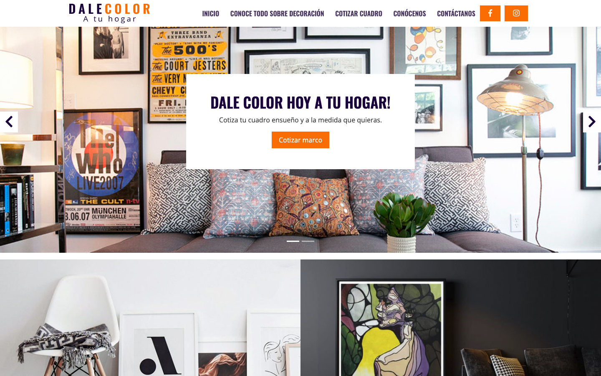
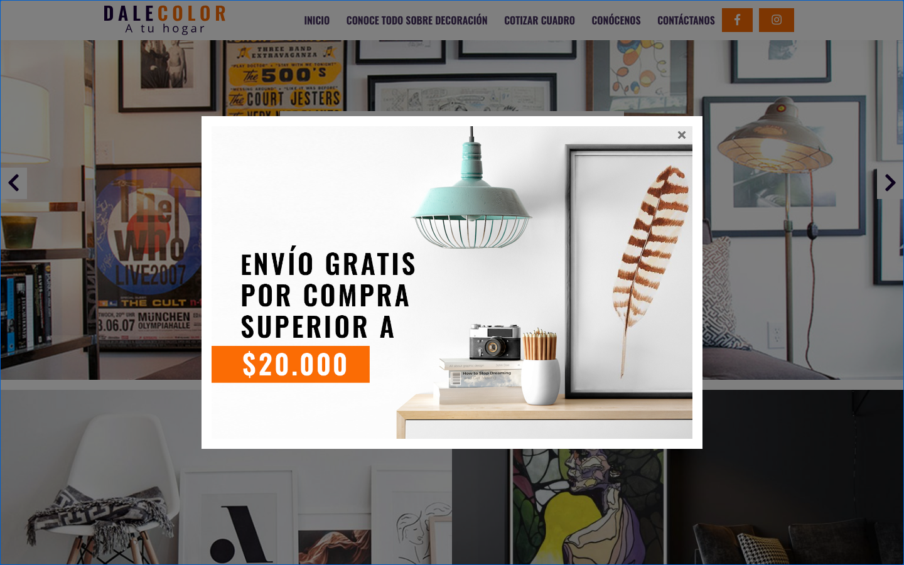
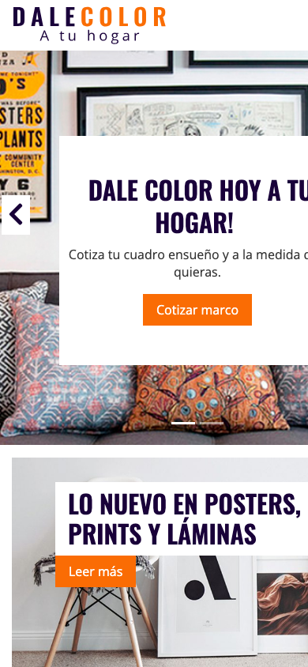

# Tema DaleColor — Tema WordPress a medida

Tema de WordPress desarrollado desde cero para **DaleColor**, una tienda (ficticia) de cuadros, prints y láminas decorativas de Santiago de Chile. Proyecto de diseño y desarrollo web completo: identidad, maquetación responsive y tema WordPress funcional con contenido administrable.

## Características

- **Slider principal** con llamadas a la acción, construido con el carousel de Bootstrap
- **Popup promocional** al ingresar al sitio (envío gratis sobre $20.000)
- **Cotizador de marcos** integrado con Contact Form 7
- **Blog** con banners destacados administrables desde WordPress
- **Secciones institucionales**: servicios, nosotros, contacto con WhatsApp
- **Diseño responsive** (mobile first) con Bootstrap 4.6

| Escritorio | Móvil |
|---|---|
|  |  |

El recorrido completo de la página: [docs/pagina-completa.png](docs/pagina-completa.png)

## Tecnologías

- WordPress (tema a medida, probado en WP 7.0.1 / PHP 8.2)
- Bootstrap 4.6 (vía CDN)
- PHP, jQuery y CSS propio
- Plugins requeridos: [Contact Form 7](https://wordpress.org/plugins/contact-form-7/) y [SVG Support](https://wordpress.org/plugins/svg-support/)

## Instalación

1. Copiar esta carpeta en `wp-content/themes/tema-dale-color`
2. Instalar y activar los plugins Contact Form 7 y SVG Support
3. Activar el tema desde **Apariencia → Temas**

## Autora

**Claudia Rivas Milla** — diseño y desarrollo
[LinkedIn](https://www.linkedin.com/in/laclaudiarm/) · [Behance](https://www.behance.net/claudiariv03fa)

Licencia: [GPL v2 o posterior](https://www.gnu.org/licenses/gpl-2.0.html), como todo tema de WordPress.
